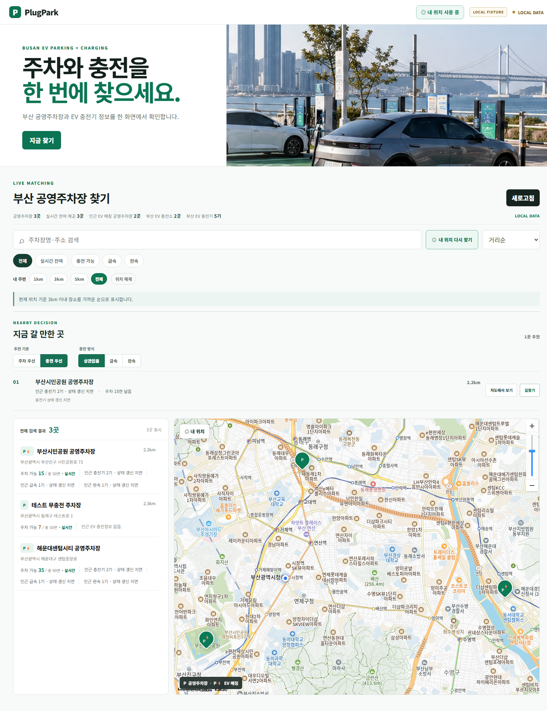
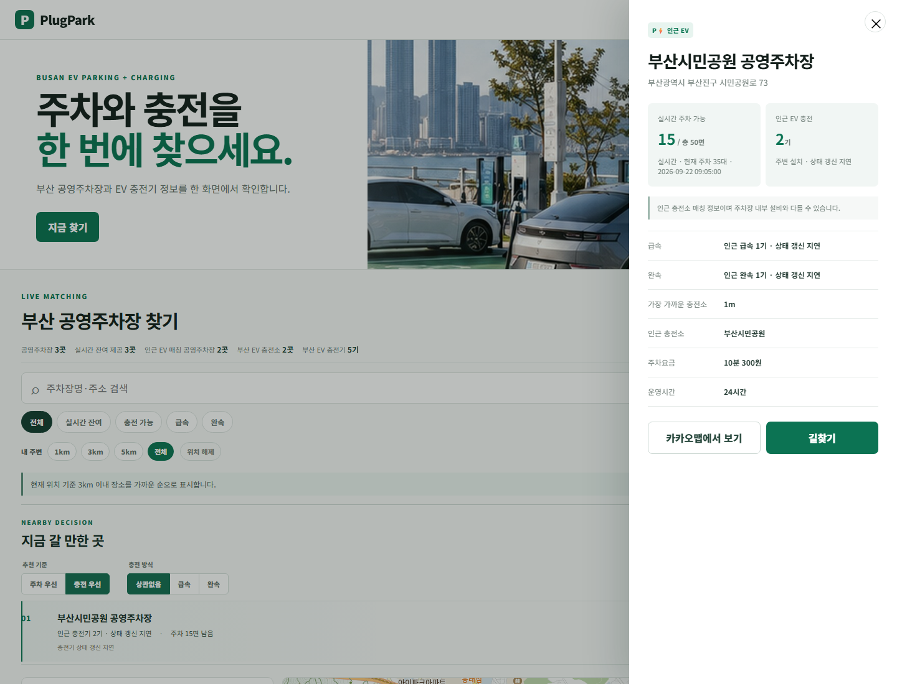
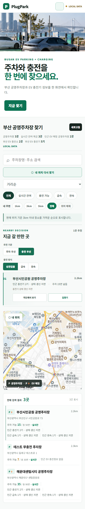
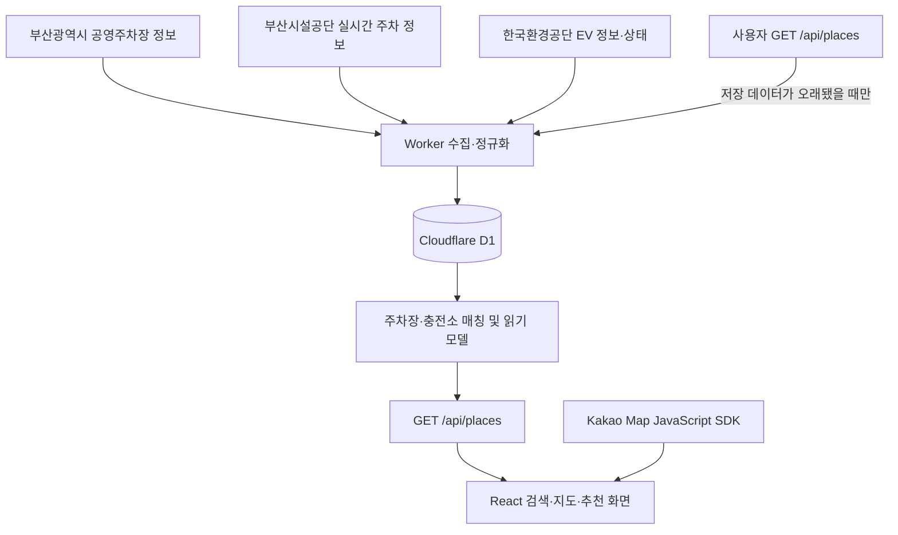

# PlugPark

**부산 공영주차장과 인근 전기차 충전 정보를 한 화면에서 확인하는 웹 서비스**

주차 공간을 찾은 뒤 충전소를 다시 검색하는 번거로움을 줄이기 위해, 공영주차장 위치와 EV 충전소를 공간적으로 매칭합니다. 주차 잔여 면수, 충전기 상태, 거리와 데이터 갱신 상태를 함께 확인하고 목적에 맞는 장소를 선택할 수 있습니다.


## 주요 기능

| 기능 | 설명 |
| --- | --- |
| 통합 검색 | 주차장명·주소·관리기관·충전소명으로 검색 |
| 주차 현황 | 실시간 잔여 면수·총 면수·현재 주차 대수 표시, 미제공 데이터 구분 |
| 충전 현황 | 충전 가능·충전 중·점검/중지 상태와 급속·완속별 수량 표시 |
| 필터와 정렬 | 실시간 잔여·충전 가능·급속·완속 필터, 충전 가능순·주차 여유순·거리순 정렬 |
| 내 주변 검색 | 현재 위치를 기준으로 1km·3km·5km 또는 전체 범위 검색 |
| 맞춤 추천 | 주차 우선 또는 충전 우선으로 최대 3곳 추천, 급속·완속 선호와 추천 이유 표시 |
| 지도와 상세 정보 | Kakao Map 마커, 추천 장소 지도 이동, 요금·운영시간·충전소 목록 확인 |
| 길찾기 | 선택한 장소를 카카오맵에서 확인하거나 길찾기로 연결 |
| 반응형 화면 | 데스크톱 목록·지도 구성과 모바일 상세 패널 지원 |

추천은 거리와 실제 잔여 상태, 충전 유형, 데이터 신선도를 함께 고려합니다. 최신 실시간 정보에서 만차인 주차장은 추천에서 제외하며, 갱신 지연이나 일부 충전소의 이용 제한 가능성을 표시합니다.

## 화면 미리보기

아래는 로컬 테스트 데이터(`LOCAL DATA`)로 실행한 실제 앱 화면입니다. 운영 데이터의 수량이나 현재 이용 가능 상태를 의미하지 않습니다.



| 장소 상세 정보 | 모바일 화면 |
| --- | --- |
|  |  |

## 사용 흐름

1. 주차장명이나 주소를 검색하거나 **내 위치**를 선택합니다.
2. 검색 반경과 필터를 지정하고 **주차 우선 / 충전 우선** 추천을 확인합니다.
3. 목록이나 지도에서 장소를 선택해 주차·충전 상태, 요금과 운영시간을 확인합니다.
4. **길찾기**로 카카오맵에 연결합니다.

## 데이터 처리 구조

사용자 화면의 `/api/places` 요청은 먼저 D1 읽기 모델을 조회합니다. 저장된 실시간 상태가 오래된 경우에만 같은 사용자 요청을 계기로 백그라운드 동기화를 예약합니다. 사용자가 페이지를 사용하지 않는 동안에는 주기 수집을 수행하지 않습니다. 추천 계산은 프런트엔드에서 수행합니다.



- **공간 매칭:** 주차장과 충전소 좌표의 거리를 계산합니다. 기본 반경은 200m이며, 서버 설정으로 50~500m 범위에서 조절합니다.
- **주차 실시간 매칭:** 시설 코드·별칭 규칙과 이름 매칭을 사용하며, 모호한 연결은 별도로 처리합니다.
- **상태 갱신:** 운영 Cron은 사용하지 않습니다. 사용자가 `/api/places`를 요청했을 때만 저장 데이터의 신선도를 확인하고, EV 상태나 실시간 주차 데이터가 오래된 경우 백그라운드에서 필요한 동기화를 수행합니다. 같은 시점의 연속 요청은 짧은 refresh gate로 중복 실행을 줄입니다.
- **데이터 검증:** 주차 잔여·사용·총 면수의 합계가 맞지 않는 원본은 정상 데이터로 임의 보정하지 않습니다.
- **유형별 집계:** 급속·완속 설치 수와 충전 가능 수를 각각 집계해 추천 및 상세 화면에 사용합니다.
- **갱신 상태:** 오래된 상태와 미제공 상태를 구분합니다. 인근 충전소 매칭은 해당 주차장 내부 설치나 누구나 이용 가능함을 보장하지 않습니다.

## 기술 스택

| 영역 | 구성 |
| --- | --- |
| 프런트엔드 | React 19, TypeScript, Vite 7, CSS |
| 서버 | Cloudflare Workers, TypeScript |
| 저장소 | Cloudflare D1, SQL 마이그레이션 |
| 지도 | Kakao Map JavaScript SDK |
| 수집 | 사용자 요청 기반 Worker 동기화, 공공데이터 API, 증분 상태 갱신 |
| 검증 | Node.js 회귀 검증, 로컬 Worker·D1 통합 검증, GitHub Actions |

## 로컬 실행

**권장 환경:** Node.js 24, npm. CI도 Node.js 24를 사용합니다.

```bash
npm ci
```

### 1. 환경 파일 준비

프로젝트 루트의 예제 파일을 복사합니다.

```bash
cp .env.example .env
cp .dev.vars.example .dev.vars
```

Windows PowerShell에서는 다음 명령을 사용합니다.

```powershell
Copy-Item .env.example .env
Copy-Item .dev.vars.example .dev.vars
```

| 파일 | 변수 | 용도 |
| --- | --- | --- |
| `.env` | `VITE_KAKAO_MAP_JS_KEY` | Kakao Map JavaScript 키 |
| `.dev.vars` | `BUSAN_PARKING_API_KEY` | 부산 공영주차장·시설공단 API 인증키 |
| `.dev.vars` | `EV_CHARGER_API_KEY` | 한국환경공단 EV API 인증키 |
| `.dev.vars` | `INGEST_ADMIN_TOKEN` | 실제 수집·관리 API 인증 토큰; 실제 연동 시 추가 |
| `.dev.vars` | `BUSAN_REALTIME_PARKING_API_URL` | 시설공단 `ParkingInfoService_v2` 기본 주소; 예제에 포함 |
| `.dev.vars` | `MATCH_RADIUS_METERS` | 주차장과 충전소 매칭 반경; 기본값 `200` |

지도 사용 시 Kakao Developers에 접속 도메인(예: `http://127.0.0.1:8787`, `http://localhost:5173`)을 등록해야 합니다. JavaScript 키는 브라우저에 전달되는 공개 키이므로 사용 도메인을 제한합니다. 공공데이터 API 키와 관리자 토큰은 서버 설정에만 둡니다.

### 2. 앱과 로컬 API 함께 실행

```bash
npm run local:dev
```

접속 주소: **http://127.0.0.1:8787**

이 명령은 프런트엔드 빌드, 전용 로컬 D1 초기화, 테스트 데이터 입력, 읽기 모델 준비와 로컬 동기화를 수행합니다. 화면에는 `LOCAL FIXTURE / LOCAL DATA`가 표시됩니다. 공공데이터 API 키 없이 테스트 데이터를 사용할 수 있으며, 원격 D1이나 운영 배포를 변경하지 않습니다. 지도 표시는 별도의 Kakao JavaScript 키가 필요합니다.

`local:dev`와 `local:reset`은 `.plugpark/r1-local-state`의 테스트 DB를 초기화합니다. 종료는 `Ctrl+C`입니다.

### 3. 프런트엔드 개발 및 빌드

```bash
npm run dev
npm run build
npm run preview
```

`dev`는 Vite 개발 서버입니다. 현재 Vite 설정에는 Worker API 프록시가 없으므로 프런트엔드만 실행하면 API 연결 실패 안내와 `DEMO` 예시 데이터가 표시됩니다. API까지 확인하려면 `local:dev`를 사용합니다. `preview`는 빌드된 프런트엔드를 확인하는 명령입니다.

PowerShell 실행 정책으로 `npm.ps1`이 차단되면 `npm.cmd run local:dev`처럼 실행할 수 있습니다.

## 검증 명령

```bash
# 추천 로직과 화면 연결 검증
npm run test:recommendation
npm run test:recommendation-ui

# 데이터 계약·매칭·읽기 비용 등 로컬 검증
npm run local:verify

# 빌드와 로컬 Worker·D1 통합을 포함한 전체 R1 검증
npm run verify:r1

# 릴리스 가드 및 유형별 집계 초기화 로컬 검증
npm run verify:release:v080-r1
```

검증에는 위치·반경·만차 제외·급속/완속 가용 수·갱신 지연·이용 제한·입력 불변성·추가 API 호출 여부가 포함됩니다. 로컬 검증 결과와 DB는 `.plugpark/`에 생성되고 Git에서 제외됩니다.

## Cloudflare 배포

자신의 Cloudflare 계정에 D1을 생성하고 `wrangler.toml`의 `database_id`와 Worker 이름을 설정합니다. `.env`의 지도 키는 프런트엔드 빌드 시 반영되므로 배포 전에 준비합니다.

```bash
npx wrangler login
npm run d1:create

# 생성 결과의 database_id를 wrangler.toml에 반영한 뒤 실행
npm run d1:migrate:remote
npx wrangler secret put BUSAN_PARKING_API_KEY
npx wrangler secret put EV_CHARGER_API_KEY
npx wrangler secret put INGEST_ADMIN_TOKEN
npm run deploy
```

새 DB는 마이그레이션과 배포만으로 실제 데이터가 채워지지 않습니다. EV 초기 적재, 주차 기본 정보 수집, 읽기 모델 준비와 상태 동기화가 필요합니다. 운영 배포에는 Cron trigger가 없으므로 사용자가 페이지를 사용하지 않는 동안 주기적인 D1 write가 발생하지 않습니다. `scripts/ev-backfill.mjs` 등 운영 도구는 기존 운영 주소를 기본값으로 사용하므로 새 환경에서는 대상 주소를 먼저 설정해야 합니다.

기존 운영 환경의 v0.8.0-R1 업그레이드는 [릴리스 절차](docs/releases/v0.8.0-r1-release-plan.md)를 따릅니다. 전용 `preflight:v080-r1` / `release:v080-r1` 도구는 기존 데이터·브랜치·로컬 검증 결과·미적용 마이그레이션 상태를 전제로 합니다. 새 설치에 그대로 적용하지 않습니다.

## 프로젝트 구성

```text
PlugPark/
├── src/
│   ├── components/          # 지도와 추천 패널
│   ├── presentation/        # 충전 상태 표시 문구
│   ├── recommendation/      # 추천 로직과 타입
│   ├── App.tsx              # 검색·목록·상세 화면
│   ├── types.ts             # API 및 화면 데이터 타입
│   └── styles.css           # 반응형 스타일
├── worker/index.ts          # API·수집·매칭·요청 기반 동기화
├── migrations/              # D1 스키마 및 읽기 모델 변경
├── scripts/                 # 로컬 실행·검증·운영 도구
├── tests/                   # 데이터 계약 및 테스트 데이터
├── public/                  # 앱 이미지
├── docs/
│   ├── api-guides/           # 제공기관 API 가이드
│   ├── releases/             # 운영 릴리스 절차
│   └── screenshots/          # README 화면 캡처
├── .github/workflows/        # CI와 운영 워크플로
├── .env.example              # 공개 지도 키 설정 예제
├── .dev.vars.example         # Worker 설정 예제
└── wrangler.toml             # Worker·D1 설정
```

## 현재 구현 범위

`package.json` 기준 버전은 **0.8.0**, 추천 기능 식별자는 **v0.8.0-R1**입니다. 통합 검색, 지도·상세·길찾기, 내 주변 검색, 추천, 유형별 충전 가능 수 집계, 데이터 신선도 표시와 로컬 검증·릴리스 도구를 포함합니다.

화면은 실제 D1 데이터를 사용하는 `LIVE DATA`, 로컬 테스트 데이터인 `LOCAL DATA`, API 연결 실패 시 예시 데이터인 `DEMO`를 구분합니다. 이 문서는 현재 구현을 기준으로 작성했으며, 운영 배포 완료나 실시간 데이터의 전체 시설 커버리지를 확인한 보고서는 아닙니다.

## 저장소에 포함하지 않는 파일

`.gitignore`는 의존성·빌드 결과물·로컬 DB·수집 결과·검증 로그·실제 환경 설정·임시 파일·이전 패치 적용 메모를 제외합니다. 예제 환경 파일, 소스, SQL 마이그레이션, 테스트 데이터, API 가이드와 README 스크린샷은 포함합니다.

실제 API 인증키와 관리자 토큰은 `.env` / `.dev.vars` 또는 Cloudflare Secrets로 관리하며 커밋하지 않습니다.
